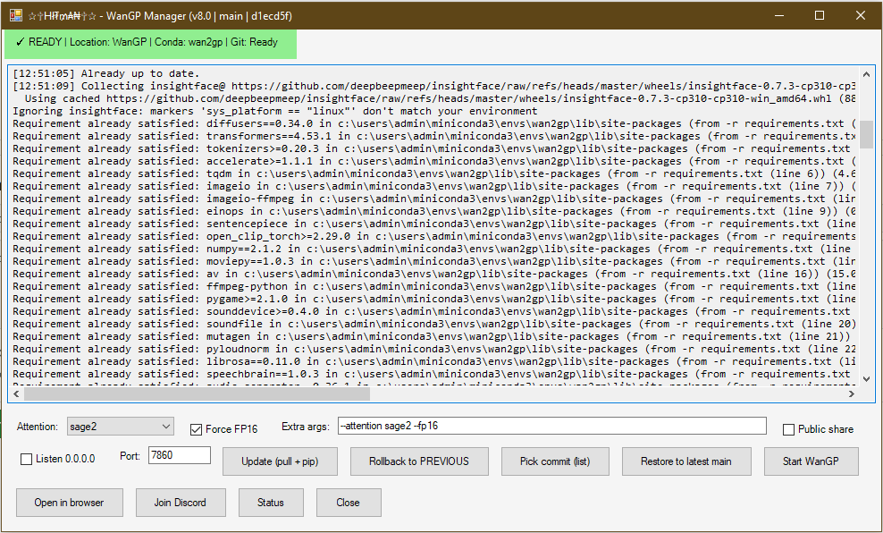

# WanGP Manager EXE Builder

PowerShell script that builds a standalone **.exe** launcher for **WanGP (Wan2GP)** with a simple WinForms GUI.  
It automatically checks/installs **PS2EXE**, detects **Conda/Python/Git**, and lets you update/rollback/restore the repo and start **WanGP** with selectable options (attention, FP16, share/server settings).

> Upstream project: https://github.com/deepbeepmeep/Wan2GP

---

## Features

- **One-command EXE build** using PS2EXE (`-NoConsole -NoOutput -RequireAdmin`).
- **Environment discovery**: finds Conda, activates an environment (`wan2gp`, `wangp`, `base`, etc.), and checks Python/Git.
- **GUI controls**:
  - **Update (pull + pip)**: `git pull` and `pip install -r requirements.txt`
  - **Rollback to PREVIOUS**: creates a backup tag, then `git reset --hard HEAD~1`
  - **Pick commit (list)**: choose a commit and hard reset (with backup tag)
  - **Restore to latest main**: `git fetch`, `checkout main`, `reset --hard origin/main`
  - **Start WanGP**: runs `python wgp.py` with your selected flags
  - **Open in browser**: opens `http://localhost:<port>` (default `7860`)
  - **Join Discord**: opens the provided channel URL
  - **Status**: quick `git` and repo status
- **Network params**: server name/port + optional public share (sets `GRADIO_*` env vars).
- **Safe fallback**: if the strict EXE build fails, it retries with relaxed parameters.

---

## Requirements

- **Windows** with PowerShell 5.1+ (or PowerShell 7)
- **Git** installed and available in `PATH`
- **Miniconda/Anaconda** with a Python environment that can run **Wan2GP**
- Local clone of **Wan2GP** (the folder with `wgp.py` and `requirements.txt`)

> The GUI expects to run **inside the Wan2GP repo directory** so it can call `wgp.py`.

---

## Preview

